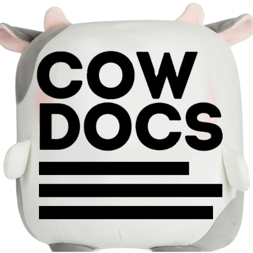
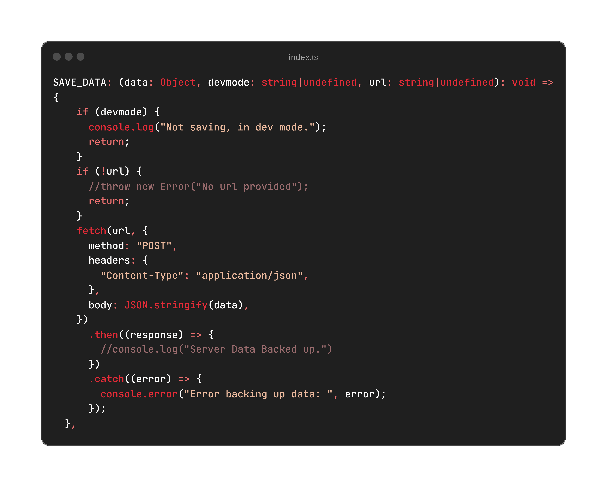

# CowTube

[](https://github.com/p1cklethenut/Cow)
[](LICENSE.txt)
<br>


## Overview

Welcome to **CowTube**! 🎉 Dive in to explore what we're building. Check out the latest changes in our [changelog](CHANGELOG.md).

## Introduction

**CowTube** is a fun and interactive web application built with Node.js, TypeScript, Express.js, and WebSocket. 🚀 Engage in duels, contribute cows, buy skins, and climb the leaderboard! 🏆

## CowTube Setup and Configuration 🔧

This guide will help you customize, run, and deploy your own instance of **CowTube**. Follow these steps to get started.

<details><summary>Quick Setup 🚀</summary>
   
Set up your own instance of CowTube in no time! 🕒

```bash
npm install typescript --save-dev
git clone https://github.com/p1cklethenut/Cow.git
cd Cow || exit
npm install
touch .env
echo "ACCESS_TOKEN=token
PORT=3000
" >> .env
read -r -p "Build and run? [y/N] " response
if [[ "$response" =~ ^([yY][eE][sS]|[yY])$ ]]; then
    echo "Building..."
    npx tsc
    echo "Running..."
    node build/index.js
else
    echo "Exiting..."
fi
```
</details>

<details><summary>Prerequisites 🛠️</summary>

> Using a node version that does not have `fetch()` built in will result in a error!

1. **Node.js**: Ensure you have [Node.js](https://nodejs.org) installed (preferably the latest LTS version).
2. **TypeScript Compiler**: Install TypeScript globally if you haven't already:
   ```bash
   npm install typescript --save-dev
   ```
</details>

<details><summary>Cloning the Repository 📁</summary>

```bash
git clone https://github.com/p1cklethenut/Cow.git
cd Cow
```
</details>

<details><summary>Installing Dependencies 📦</summary>

> Yarn is this project's prefered package manager but any other will work just fine!

```bash
yarn install
```
or
```bash
npm install
```
</details>

<details><summary>Configuration 📝</summary>

CowTube uses environment variables for easy customization and security. Here's how to set them up:

### Environment Variables 🌍

Create a `.env` file in your project's root with the following:

```plaintext
ACCESS_TOKEN=your_access_token
DEVMODE=delete_this_line_or_define_it
DEVLOG_URL=https://your-devlog-url
EXTERNAL_URL=https://your-external-url
LOGGING_ID=your-logging-id
PORT=3000
RATE_LIMIT_WINDOW_MS=300000
RATE_LIMIT_MAX=100
ENVTIMEBLOCK=your_timeblock_value
YOUTUBE_API_KEY=your_youtube_api_key
DATABASE_BACKUP_URL=https://your-database-backup-url
```

#### Required Settings ⚙️

> Lack of any of these settings will throw an error.

- **`ACCESS_TOKEN`**: Your server credentials for secure operations.
- **`PORT`**: The port number for the server.

#### Optional Settings 🧩

- **`LOGGING_ID`**: Set up for logging services. If not used, set to `null`.
- **`EXTERNAL_URL`**: The URL for your site. If not needed, set to `null`.
- **`RATE_LIMIT_WINDOW_MS`** and **`RATE_LIMIT_MAX`**: Controls for rate limiting. If not needed, set to `null`.
- **`YOUTUBE_API_KEY`**: For YouTube features. If not used, set to `null`.

#### Special Settings ⭐

- **`DEVMODE`**: When defined, does not backup testing data.

### Backing up

#### You can edit the SAVE_DATA function in config.ts as shown below



> this function is called every 30 seconds via setInterval
</details>

<details><summary>Running the Application ▶️</summary>

1. **Compile the TypeScript Code**:
   ```bash
   npx tsc
   ```
2. **Start the Server**:
   ```bash
   node build/index.js
   ```
   The application should now be running on `http://localhost:3000` or your configured port.

---
</details>

## Features 🎮

- **Main Page**: Where the magic happens! 🌟
- **Leaderboard Page**: See who's on top! 📈
- **Profile Page**: Personalize your experience. 🖼️
- **Duels**: Challenge others! ⚔️
- **Skins**: Customize your cows! 🎨

---

## Project Structure 📂

<details><summary>Directory</summary>

```plaintext
Cow/
│
├── build/ # Built HTML, CSS, JS, and images
│ ├── 404page/ # Custom 404 page assets
│ ├── admin_page/ # Admin page assets
│ ├── cow/ # Main cow pages and images
│ ├── cowlb/ # Leaderboard page
│ ├── cowskins/ # Collection of cow skin images
│ ├── duels/ # Cow duels page
│ ├── home/ # Experimental home page
│ ├── offlinescript/ # Offline script for the website
│ ├── profile/ # Profile page
│ └── rv/ # Random video off query
│
├── src/ # Source TypeScript files
│ ├── index.ts # Main TypeScript entry file
│ └── cowtypes/ # Type definitions
│
├── .gitignore # Git ignore file
├── CHANGELOG.md # Project changelog
├── README.md # Project README
├── LICENSE.txt # Project license
├── package.json # Node.js package configuration
├── tsconfig.json # TypeScript configuration
└── yarn.lock # Yarn lockfile for dependency management
```
</details>

---

## Contributing 🤝

**CowTube** is a personal hobby project, but contributions are welcome! Fork the repository, make your changes, and submit a pull request. For questions, open an issue! 🌟

---

## Changelog 📝

Stay updated with the latest changes in our [changelog](CHANGELOG.md).

